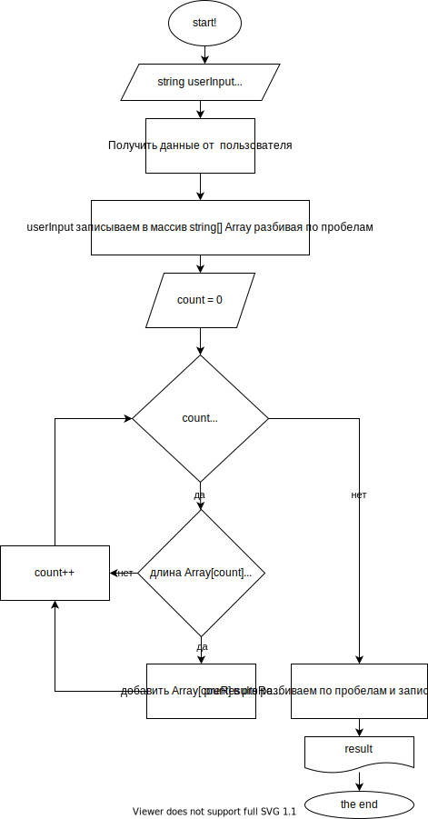

# Итоговая контрольная работа

## Задание
Написать программу, которая из имеющегося массива строк формирует массив из строк, длина которых меньше либо равна 3 символам. Первоначальный массив можно ввести с клавиатуры, либо задать на старте выполнения алгоритма. При решении не рекомендуется пользоваться коллекциями, лучше обойтись исключительно массивами.

## Блок-схема

## Использование
На старте программа запрашивает произвольный текст.
В результате работы на консоль выводится количество удовлетворяющих условию слов и сами слова.